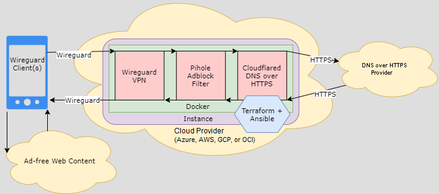

# Wirehole in Cloud

## Abstract:

This project is centered around getting a Raspberry Pi set up on a simple home network in order to block ads and naughty DNS requests, secure the DNS requests of all devices on the network, and provide a VPN solution for when any of these devices are outside of the network and would like to take advantage of the security (and speed) benefits of the network remotely.There are several guides written about this or similar setups, but in practice, there was always something missing or assumptions were made about certain steps in the process. Instead of writing another guidline I have decided to automate lengthy automation process by

WireHole is a combination of WireGuard, PiHole, and Unbound in a docker-compose project with the intent of enabling users to quickly and easily create and deploy a personally managed full or split-tunnel WireGuard VPN with ad blocking capabilities (via Pihole), and DNS caching with additional privacy options (via Unbound).

## Installing Pi-Hole

## Setting-up Unbound

## Installing Wireguard VPN

## Creating Tor Proxy

## Auto Deployment in the Cloud
# Overview
End-to-end DNS encryption with DNS-based ad-blocking, built in the cloud automatically using Terraform with Ansible. Choose your cloud provider or a standalone installation.

Combines wireguard (DNS VPN), pihole (adblock), and cloudflared (DNS over HTTPS) docker containers, as visualized:

# Instructions
Several deployment options are available, see the README of each subdirectory for platform-specific guides.
- AWS (Amazon)
- Azure (Microsoft)
- DO (Digital Ocean)
- GCP (Google)
- Lightsail (Fixed-rate/Low-cost AWS)
- OCI (Oracle)
- SCW (Scaleway)
- Standalone Raspberry Pi or Ubuntu Server (under playbooks/)
