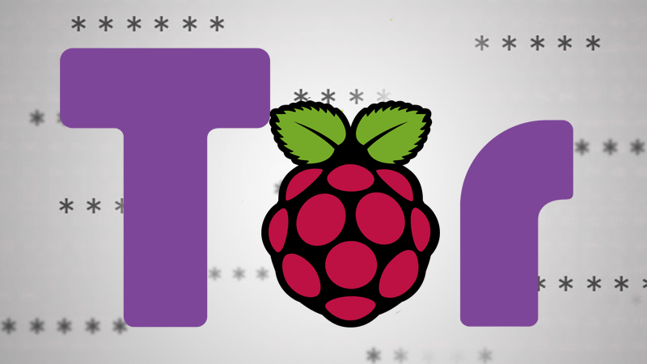
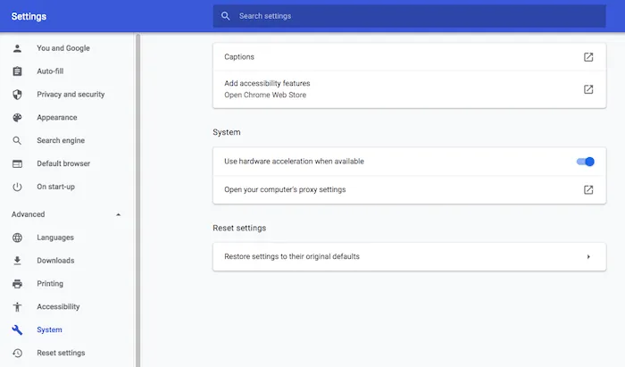
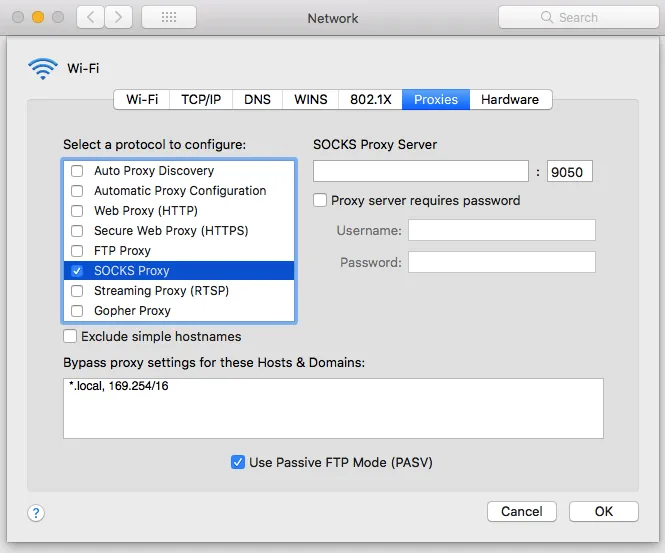

# Wirehole & TorProxy in Cloud

This project is centered around getting a Raspberry Pi set up on a simple home network in order to block ads and DNS requests, secure the DNS requests of all devices on the network, and provide a VPN solution for when any of these devices are outside of the network and would like to take advantage of the security (and speed) benefits of the network remotely.There are several guides written about this or similar setups, but in practice, there was always something missing or assumptions were made about certain steps in the process. Instead of coming up with another guidline I have decided to automate lengthy installation process.


WireHole is a combination of WireGuard, PiHole, and Unbound in a docker-compose project with the intent of enabling users to quickly and easily create and deploy a personally managed full or split-tunnel WireGuard VPN with ad blocking capabilities (via Pihole), and DNS caching with additional privacy options (via Unbound).

In addition, for extra privacy we will add Tor proxy server to our Wirehole. Tor network, is one of the most popular ways to avoid all forms of online surveillance. By setting up a Tor proxy on Raspberry Pi we will automatically route traffic via Tor every time we connect to our home network.

Finally, we will see how we can bring Wirehole with dedicated Tor proxy to Cloud. We will deploy Wireguard VPN, Pi-Hole DNS Ad-blocking, and Tor proxy over HTTPS in a cloud provider - or locally - using Terraform and Ansible.


## What you’ll need

Raspberry Pi that’s running Raspberry Pi OS
Power cable that’s compatible with your Raspberry Pi.
External keyboard and a way to attach it to your Raspberry Pi
HDMI or micro HDMI cable, depending on your model of Raspberry Pi
External monitor
Ethernet cable if not connecting over Wi-Fi


## Quickstart
To get started all you need to do is clone the repository and spin up the containers.

```bash
git clone https://github.com/zallahve/wirehole.git
cd wirehole
docker-compose up
```
### Full Setup
```bash
#!/bin/bash

# Prereqs and docker
sudo apt-get update &&
    sudo apt-get install -yqq \
        curl \
        git \
        apt-transport-https \
        ca-certificates \
        gnupg-agent \
        software-properties-common

# Install Docker repository and keys
curl -fsSL https://download.docker.com/linux/ubuntu/gpg | sudo apt-key add -

sudo add-apt-repository \
    "deb [arch=amd64] https://download.docker.com/linux/ubuntu \
        $(lsb_release -cs) \
        stable" &&
    sudo apt-get update &&
    sudo apt-get install docker-ce docker-ce-cli containerd.io -yqq

# docker-compose
sudo curl -L "https://github.com/docker/compose/releases/download/1.26.2/docker-compose-$(uname -s)-$(uname -m)" -o /usr/local/bin/docker-compose &&
    sudo chmod +x /usr/local/bin/docker-compose &&
    sudo ln -s /usr/local/bin/docker-compose /usr/bin/docker-compose

# wirehole
git clone https://github.com/zallahve/wirehole.git &&
    cd wirehole &&
    docker-compose up

```


Within the output of the terminal will be QR codes you can (if you choose) to setup it WireGuard on your phone.

```bash
wireguard    | **** Internal subnet is set to 10.6.0.0 ****
wireguard    | **** Peer DNS servers will be set to 10.2.0.100 ****
wireguard    | **** No found wg0.conf found (maybe an initial install), generating 1 server and 1 peer/client confs ****
wireguard    | PEER 1 QR code:
wireguard    | █████████████████████████████████████████████████████████████████
wireguard    | █████████████████████████████████████████████████████████████████
wireguard    | ████ ▄▄▄▄▄ █▀▀▀▄ ▀▀▀▀▄█ ██   ▄▀ ██ ██▄▀█    █▄▄█▀ ▄ ██ ▄▄▄▄▄ ████
wireguard    | ████ █   █ █▀▄█▀█▄█▄██▀▄   ▀▀██▀▄█ ▀▄█  ▀ █▀▄█▄ ▄▄▄ ██ █   █ ████
wireguard    | ████ █▄▄▄█ █▀█   ▀▀▄                               ▄██ █▄▄▄█ ████
wireguard    | ████▄▄▄▄▄▄▄█   ▀ ▀   █                         █▄█▄▀ █▄▄▄▄▄▄▄████
wireguard    | ████ ▄▄  █▄▄▄  ▄▀█▀▀▄    ▀█ ▀█  ▄  █▀▀▄▄██▄▄▀▀█▄ ██▀▀ █ █▄█ ▀████
wireguard    | █████  ▄█ ▄  ▀▀█▄▄  █▀ ▀ ▀ ▄  ▄ ▀▄▀▀█ ██ ▀██▀   ▀ ▀▀   ▀  ▀▄ ████
wireguard    | ████▀▀██  ▄▄▄ ██▀▄▄██▀ ██▀▄  ▀▀ █▄█   ▄ ▄█▄██   ▀▄▄█  █▀▀█ ▄▀████
wireguard    | ████ ▄█▀█▀▄▄   ▄███ ▄█ ▀▀▀▀█ ▄█ ▀▀▀▀▀▄ █   █ ███▄ █ ▄▄▄▄▀▀▀ █████
wireguard    | ████▀▄ ▀▀ ▄▄ ▄▄  █▀██    ▀▀▀▀▀  ▄  █▀▀██  ██▀   ▀█▄█▄█  ▄▄▀ ▀████
wireguard    | ████   ▀█ ▄▄                                          █  ▀▀██████
wireguard    | ███████  ▄▄█ █                                        ▄█▀█▀▀▄████
wireguard    | ████ ▄  █▄▄▀  ▄   ▀▄ █ ▄██▀▀█▀   █▄▄█▀▄█▀█▄ █ ▀▄█ ▄█ ▀   █  █████
wireguard    | ████▄██▀█▄▄ ▀ ▄▀                       ▀▄  ▄█ ▀▄  █▀ ▀██▀▄███████
wireguard    | ████ ▀█  ▄▄▄ ██▀███▄█▄█ █▄█▀ ▀ ▄▄▄ ▀▀  ▀▄ ▀▀█   █ █  ▄▄▄   ▄▀████
wireguard    | ████▄██  █▄█  █                                          ▀▀ ▀████
wireguard    | █████▀█▄▄▄▄▄ █▄ ▀▄ ██  ██▀ ▄ █▄ ▄▄▄▀ ▀▄▀█  █▀ █▄ ▄ ▄▄▄  ▄ ▀▄█████
wireguard    | █████▀▄▀  ▄▄█▄▀ ██▄▄▄    █▀  ██    ██ █▄   ██▄ ▄▀█▄██▀▄█   █▀████
wireguard    | ████▄   ▀ ▄ ▀ ▀▀▀▀▀▀█▀██▀ █  █▀█▀███ ▀▄█  █▄ █     ▀▀█▀██▀ ▄█████
wireguard    | ████ ▀ ▄   ██▄ ▀▀▀▄▀█  ▀▀▄ ▄ ▄  █▀▀▄█ ▄█▄▀█▄█▀ ▄▀█▄▀ ▀▀▀ ▀▀ ▀████
wireguard    | ███████ ▄█▄  ▀█▄▄  ▀█ █▀ █▀▄ ▄ ▀▄█▄▄█▀▄█▄▄▄▄█▀ ▀█ █▀  ▄ ██▀▄█████
wireguard    | ████▀█ █▀ ▄                                             █ ▄▀█████
wireguard    | ████▀▄ ▄▄█▄▄  ▄ ▄██▄ ▀ █ ▀ ▄▄█▀▀ ▄ ▀▀▄█▀▄██▀▀ ▄   ▄▄▄▄▀▀▄▀▀▀ ████
wireguard    | ████ ▀▄▄▀▀▄▀▀▀▄ ▄ █▄▄▀ ██▀▄▀ █▄██▀▀▄█▄▄█ ████▄ ▀█▄█▀▄▀ ▀▄ ▀ █████
wireguard    | ████ ▀ ▀▀▄▄ ▄ █▄ ▄ ██ ▄▀█▄▄  ▄ ▄ █▄▀ ▄▄▀██▄▀▀██▀▀▄▄ ▄   ██ ▄▀████
wireguard    | ██████████▄█▀▀█ ▄█ █▄▄ ▀▄▀█▀▀  ▄▄▄ ▀█▀█ ▄▀█▀█▀▀ ██▄▀ ▄▄▄ ▄██▄████
wireguard    | ████ ▄▄▄▄▄ █▄▄▄█▀▄█▀██ ▄ ▀█ ▀  █▄█ ▀▀█▄ ██▄█ ▀▄ ▀█▄▄ █▄█    █████
wireguard    | ████ █   █ █  ▄▄ ▄█   ▄▄█ █▀   ▄ ▄  █ ▄█▄▄█ █▀ ▄████ ▄▄  ▀▀▄▄████
wireguard    | ████ █▄▄▄█ █ ▀ ▄▄█ ▄ ▀▀▄██▄▀█▀█ █▀█▀▀▀▄   ▄ █▀▀▄▀ ▄▀███▀██▀██████
wireguard    | ████▄▄▄▄▄▄▄█▄██▄▄█▄▄▄▄▄██▄█▄▄▄█▄█▄█▄▄▄▄█▄▄▄█████▄▄█▄█▄▄████▄█████
wireguard    | █████████████████████████████████████████████████████████████████
wireguard    | █████████████████████████████████████████████████████████████████
wireguard    | [cont-init.d] 30-config: exited 0.
wireguard    | [cont-init.d] 99-custom-scripts: executing...
wireguard    | [custom-init] no custom files found exiting...
wireguard    | [cont-init.d] 99-custom-scripts: exited 0.
wireguard    | [cont-init.d] done.
wireguard    | [services.d] starting services
```

---

## Recommended configuration / Split tunnel:

Modify your wireguard client `AllowedIps` to `10.2.0.0/24` to only tunnel the web panel and DNS traffic.

---

## Access PiHole

While connected to WireGuard, navigate to http://10.2.0.100/admin

*The password (unless you set it in `docker-compose.yml`) is blank.*


---

## Configuring for Dynamic DNS (DDNS)
If you're using a dynamic DNS provider, you can edit `docker-compose.yml` under "wireguard". 
Here is an excerpt from the file. 

You need to uncomment `#- SERVERURL` so it reads `- SERVERURL` without the `#` and then change `my.ddns.net` to your DDNS URL.

```yaml
wireguard:
   # ...
    environment:
      # ...
      - SERVERURL=my.ddns.net #optional - For use with DDNS (Uncomment to use)
      # ...
 # ...
```

---
## Configuring / Parameters

Container images are configured using parameters passed at runtime (such as those above). These parameters are separated by a colon and indicate `<external>:<internal>` respectively. For example, `-p 8080:80` would expose port `80` from inside the container to be accessible from the host's IP on port `8080` outside the container.

| Parameter | Function |
| :----: | --- |
| `-p 51820/udp` | wireguard port |
| `-e PUID=1000` | for UserID - see below for explanation |
| `-e PGID=1000` | for GroupID - see below for explanation |
| `-e TZ=Europe/London` | Specify a timezone to use EG Europe/London |
| `-e SERVERURL=wireguard.domain.com` | External IP or domain name for docker host. Used in server mode. If set to `auto`, the container will try to determine and set the external IP automatically |
| `-e SERVERPORT=51820` | External port for docker host. Used in server mode. |
| `-e PEERS=1` | Number of peers to create confs for. Required for server mode. Can be a list of names too: myPC,myPhone,myTablet... |
| `-e PEERDNS=auto` | DNS server set in peer/client configs (can be set as `8.8.8.8`). Used in server mode. Defaults to `auto`, which uses wireguard docker host's DNS via included CoreDNS forward. |
| `-e INTERNAL_SUBNET=10.13.13.0` | Internal subnet for the wireguard and server and peers (only change if it clashes). Used in server mode. |
| `-e ALLOWEDIPS=0.0.0.0/0` | The IPs/Ranges that the peers will be able to reach using the VPN connection. If not specified the default value is: '0.0.0.0/0, ::0/0' This will cause ALL traffic to route through the VPN, if you want split tunneling, set this to only the IPs you would like to use the tunnel AND the ip of the server's WG ip, such as 10.13.13.1. |
| `-v /config` | Contains all relevant configuration files. |
| `-v /lib/modules` | Maps host's modules folder. |
| `--sysctl=` | Required for client mode. |

### Environment variables from files (Docker secrets)

You can set any environment variable from a file by using a special prepend `FILE__`.

As an example:

```bash
-e FILE__PASSWORD=/run/secrets/mysecretpassword
```

Will set the environment variable `PASSWORD` based on the contents of the `/run/secrets/mysecretpassword` file.

### Umask for running applications

There is the ability to override the default umask settings for services started within the containers using the optional `-e UMASK=022` setting.
Keep in mind umask is not chmod it subtracts from permissions based on it's value it does not add. Please read up [here](https://en.wikipedia.org/wiki/Umask) before asking for support.

### User / Group Identifiers

When using volumes (`-v` flags) permissions issues can arise between the host OS and the container, this is avoided by allowing you to specify the user `PUID` and group `PGID`.

Ensure any volume directories on the host are owned by the same user you specify and any permissions issues will vanish like magic.

In this instance `PUID=1000` and `PGID=1000`, to find yours use `id user` as below:

```bash
  $ id username
    uid=1000(dockeruser) gid=1000(dockergroup) groups=1000(dockergroup)
```

---

## Adding Clients
If the environment variable `PEERS` is set to a number or a list of strings separated by comma, the container will run in server mode and the necessary server and peer/client confs will be generated. The peer/client config qr codes will be output in the docker log. They will also be saved in text and png format under `/config/peerX` in case `PEERS` is a variable and an integer or `/config/peer_X` in case a list of names was provided instead of an integer.

Variables `SERVERURL`, `SERVERPORT`, `INTERNAL_SUBNET` and `PEERDNS` are optional variables used for server mode. Any changes to these environment variables will trigger regeneration of server and peer confs. Peer/client confs will be recreated with existing private/public keys. Delete the peer folders for the keys to be recreated along with the confs.

To add more peers/clients later on, you increment the `PEERS` environment variable or add more elements to the list and recreate the container.

To display the QR codes of active peers again, you can use the following command and list the peer numbers as arguments: `docker exec -it wireguard /app/show-peer 1 4 5` or `docker exec -it wireguard /app/show-peer myPC myPhone myTablet` (Keep in mind that the QR codes are also stored as PNGs in the config folder).

The templates used for server and peer confs are saved under `/config/templates`. Advanced users can modify these templates and force conf generation by deleting `/config/wg0.conf` and restarting the container.

*(This portion of documentation has been adapted from [docker-wireguard](https://github.com/linuxserver/docker-wireguard/blob/master/README.md))*

---

## Modifying the upstream DNS provider for Unbound
If you choose to not use Cloudflare any reason you are able to modify the upstream DNS provider in `unbound.conf`.

Search for `forward-zone` and modify the IP addresses for your chosen DNS provider.

>**NOTE:** The anything after `#` is a comment on the line. 
What this means is it is just there to tell you which DNS provider you put there. It is for you to be able to reference later. I recommend updating this if you change your DNS provider from the default values.


```yaml
forward-zone:
        name: "."
        forward-addr: 1.1.1.1@853#cloudflare-dns.com
        forward-addr: 1.0.0.1@853#cloudflare-dns.com
        forward-addr: 2606:4700:4700::1111@853#cloudflare-dns.com
        forward-addr: 2606:4700:4700::1001@853#cloudflare-dns.com
        forward-tls-upstream: yes
```

---

## Available DNS Providers

While you can actually use any upstream provider you want, the team over at pi-hole.net provide a fantastic break down along with all needed information of some of the more popular providers here:
https://docs.pi-hole.net/guides/upstream-dns-providers/

Providers they have the information for:

1. Google
2. OpenDNS
3. Level3
4. Comodo
5. DNS.WATCH
6. Quad9
7. CloudFlare DNS


---

## Setting a DNS record for pihole
1. Login to pihole admin
2. Navigate to "Local Records"
3. Fill out the form like the image below


Provided your DNS is properly configured on the device you're using, and you're connected to WireGuard, you can now navigate to http://pi.hole/admin and it should take you right to the pihole admin interface.

---
## Support Info

* Shell access whilst the container is running: `docker exec -it wireguard /bin/bash`
* To monitor the logs of the container in realtime: `docker logs -f wireguard`
* container version number
  * `docker inspect -f '{{ index .Config.Labels "build_version" }}' wireguard`
* image version number
  * `docker inspect -f '{{ index .Config.Labels "build_version" }}' ghcr.io/linuxserver/wireguard`

---

## Updating Info

LinuxServer images are generally static, versioned, and require an image update and container recreation to update the app inside. 
> **Note:** Updating apps inside the container is NOT supported.

Below are the instructions for updating **containers**:

### Via Docker Compose

* Update all images: `docker-compose pull`
  * or update a single image: `docker-compose pull wireguard`
* Let compose update all containers as necessary: `docker-compose up -d`
  * or update a single container: `docker-compose up -d wireguard`
* You can also remove the old dangling images: `docker image prune`

### Via Watchtower auto-updater (only use if you don't remember the original parameters)

* Pull the latest image at its tag and replace it with the same env variables in one run:

  ```bash
  docker run --rm \
  -v /var/run/docker.sock:/var/run/docker.sock \
  containrrr/watchtower \
  --run-once wireguard
  ```

* You can also remove the old dangling images: `docker image prune`

> **Note:** Watchtower is not endorsed as a solution for automated updates of existing Docker containers. In fact generally automated updates are discouraged. However, this is a useful tool for one-time manual updates of containers where you have forgotten the original parameters. In the long term, LinuxServer.io highly recommends using Docker Compose.


---


## FAQ

### How do you add client configurations?
If the environment variable `PEERS` is set to a number, the container will run in server mode and the necessary server and peer/client confs will be generated. The peer/client config qr codes will be output in the docker log. They will also be saved in text and png format under /config/peerX.

Variables `SERVERURL`, `SERVERPORT`, `INTERNAL_SUBNET` and `PEERDNS` are optional variables used for server mode. Any changes to these environment variables will trigger regeneration of server and peer confs. Peer/client confs will be recreated with existing private/public keys. Delete the peer folders for the keys to be recreated along with the confs.

To add more peers/clients later on, you increment the `PEERS` environment variable and recreate the container.

To display the QR codes of active peers again, you can use the following command and list the peer numbers as arguments: `docker-compose exec wireguard /app/show-peer 1 4 5` will show peers #1 #4 and #5 (Keep in mind that the QR codes are also stored as PNGs in the config folder).

The templates used for server and peer confs are saved under /config/templates. Advanced users can modify these templates and force conf generation by deleting /config/wg0.conf and restarting the container.

### Can I build ARM variants on x86_64?

The ARM variants can be built on x86_64 hardware using `multiarch/qemu-user-static`

```bash
docker run --rm --privileged multiarch/qemu-user-static:register --reset
```

Once registered you can define the dockerfile to use with `-f Dockerfile.aarch64`.

### Where can I get additional block lists?
* [The Big Blocklist Collection](https://firebog.net/)

### Commonly whitelisted domains
* [Pi-Hole Community List](https://discourse.pi-hole.net/t/commonly-whitelisted-domains/212)
* [anudeepND Whitelist](https://github.com/anudeepND/whitelist)

### Why do you use Unbound / What benefit is there to using Unbound?
* [PiHole Official Site: What does this guide provide?](https://docs.pi-hole.net/guides/unbound/#what-does-this-guide-provide)

---

## Networking Considerations

If you plan to use Wireguard both remotely and locally, say on your mobile phone, you will need to consider routing. Most firewalls will not route ports forwarded on your WAN interface correctly to the LAN out of the box. This means that when you return home, even though you can see the Wireguard server, the return packets will probably get lost.

This is not a Wireguard specific issue and the two generally accepted solutions are NAT reflection (setting your edge router/firewall up in such a way as it translates internal packets correctly) or split horizon DNS (setting your internal DNS to return the private rather than public IP when connecting locally).

Both of these approaches have positives and negatives however their setup is out of scope for this document as everyone's network layout and equipment will be different.


---

###### Shout out to LinuxServer.io for their documentation and maintenance of the incredible Wireguard image.


# Creating Tor Proxy



Before you begin, it’s a good idea to check that you’re running the latest version of Raspberry Pi OS. Open the Terminal and type the following command:

```
sudo apt update && sudo apt -y upgrade
```
If it does install one or more updates, then reboot your Raspberry Pi by running the following command:

sudo reboot
Install Tor on your Raspberry Pi
You can install Tor using a single Terminal command:

```
sudo apt install tor
```
You’ll now have two new services running on your Raspberry Pi: tor.service and tor@default.service.

The “tor” service is merely a dummy service that only appears active. To check that the real tor@default service is running, use the following Terminal command:

```
sudo systemctl status tor@default.service
```

If the Terminal returns an “active” message, you’re ready to move on to the next step.

Set up your proxy server by making some changes to Tor’s configuration file. Before editing this “torr” file, it’s a good idea to create a backup:
```
sudo cp /etc/tor/torrc /etc/tor/torrc.backup
```
Now that you have a backup, create a simple configuration that’ll expose the Tor Socks proxy service on port 9050 and accept connections from the local LAN.

o open the “torr” configuration file for editing, run the following command:
```
sudo nano /etc/tor/torrc
```
This file will now launch in the Nano text editor. First, specify the “SocksPort,” which is the IP address of your Raspberry Pi. You can retrieve this information by running the following Terminal command:
```
hostname -I
```
Take this IP address and add the port number :9050. For example, if the Raspberry Pi’s IP address is 192.168.1.111, then add the following to the Torr configuration file:
```
SocksPort 192.168.1.111:9050
```
Add the following to the Nano text editor, making sure to replace “SocksPort” with your own value:
```
SocksPort 192.168.1.100:9050
SocksPolicy accept 192.168.1.0/24
RunAsDaemon 1
DataDirectory /var/lib/tor
```
Once you’ve made the changes, save the file by pressing the Ctrl + O and Ctrl + X to close.

To restart the Tor service with your new configuration, run the following command:
```
sudo systemctl restart tor@default.service
```

In this final section, you’ll learn how to connect to your Raspberry Pi server, using all the major web browsers.

Note that you’ll typically connect to your Raspberry Pi using its IP address. You can retrieve this information at any point by running hostname -I in the Raspberry Pi Terminal.

 

Google Chrome (and other Chromium-based browsers)
Are you using Chrome? To point Google Chrome in the direction of your proxy server:

1. In Chrome’s upper-right corner, select the three-dot icon.

2. Select “Settings.”

3. In the menu on the left, navigate to “Advanced -> System.”

Using Google Chrome? You can edit its proxy settings, in the "Advanced > System" menu.
4. Select “Open your computer’s proxy settings.”

The next steps will vary, depending on your operating system.

macOS

If you’re a Mac user, then Google Chrome should have already launched your Mac’s “Network -> Proxies” menu. In this window:

Select “SOCKS Proxy.”





If you're a Mac user, then you'll need to edit macOS' "Network" settings.
In “SOCKS Proxy Server,” enter the IP address of your Raspberry Pi.
In the accompanying text box, enter the port number “9050.”
Save your changes by clicking “OK -> Apply.”
Close and then relaunch Chrome. When it relaunches, it should already be using the Tor network.

## Apple Safari
If you’re using Apple’s Safari browser, then:

1. In the Safari toolbar, select “Safari -> Preferences … ”

2. Select the “Advanced” tab.

3. Find “Proxies” and select its accompanying “Change Settings … ” button.

4. In the menu on the left, select “SOCKS Proxy.”

5. In “SOCKS Proxy Server,” enter the IP address of your Raspberry Pi.

6. In the accompanying text field, enter the port number “9050.”

7. Save your changes by clicking “OK -> Apply.”


Don’t forget to relaunch Safari!

Are you really using Tor?
If you’ve followed the instructions in this article, then you should now be using the Tor network – but it never hurts to check! In the web browser that you’ve configured to use Tor, head over to the Tor website.


If you see the above message, then congratulations – you’re successfully routing all of your traffic via Tor!


# Auto Deployment in the Cloud

End-to-end DNS encryption with DNS-based ad-blocking, built in the cloud automatically using Terraform with Ansible. Choose your cloud provider or a standalone installation.

Combines wireguard (DNS VPN), pihole (adblock), and cloudflared (DNS over HTTPS) docker containers, as visualized:


## Instructions
Several deployment options are available, see the README of each subdirectory for platform-specific guides.
- AWS (Amazon)
- Azure (Microsoft)
- DO (Digital Ocean)
- GCP (Google)
- Lightsail (Fixed-rate/Low-cost AWS)
- OCI (Oracle)
- SCW (Scaleway)
- Standalone Raspberry Pi or Ubuntu Server (under playbooks/)
